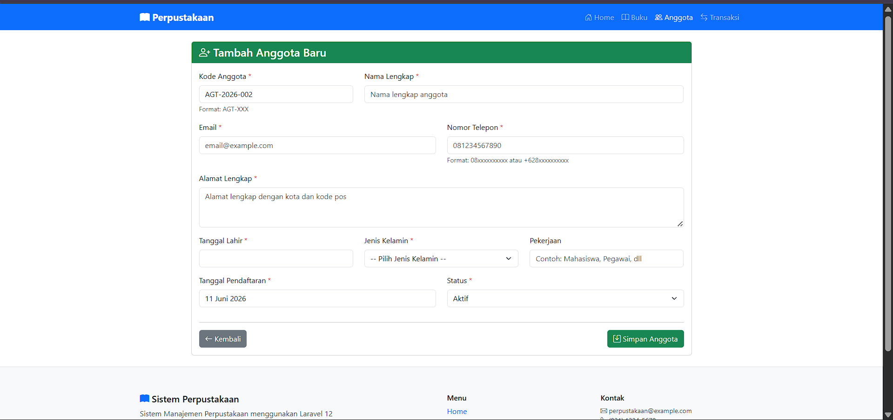
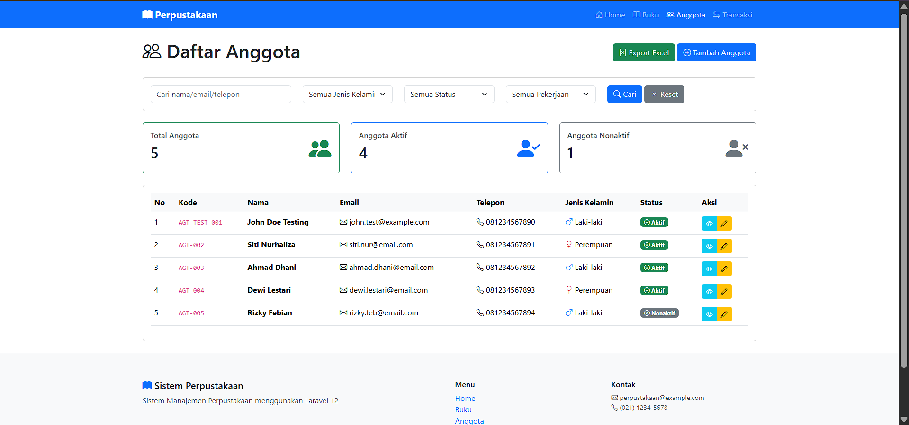
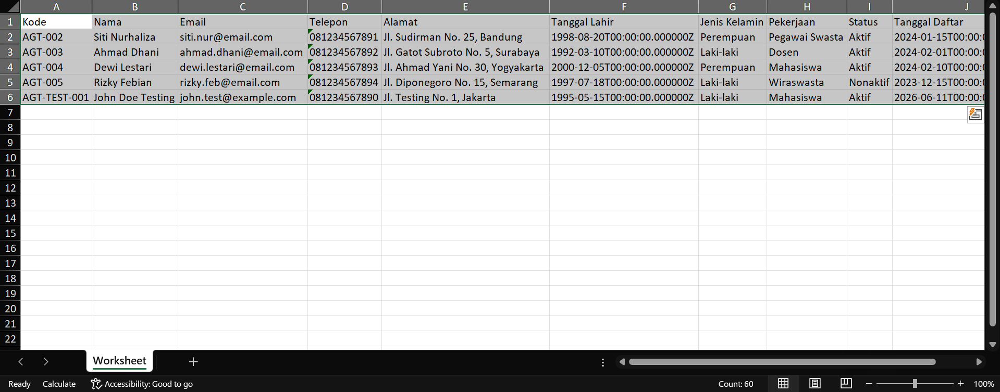
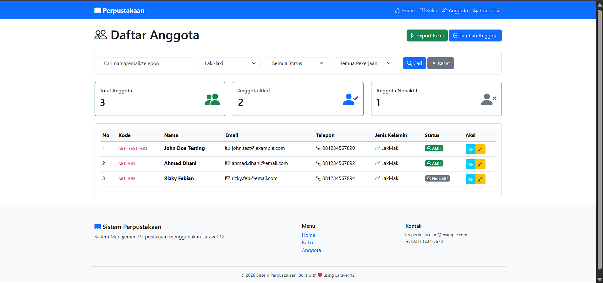

# Tugas Pertemuan 13 - Pemrograman Web II

Repositori ini berisi hasil pengerjaan **Tugas Praktikum Pertemuan 13** yang meliputi implementasi beberapa fitur lanjutan pada sistem Perpustakaan menggunakan Laravel.

## E. TUGAS

### 1. Tugas 1: Auto-Generate Kode Anggota (30%)
**Deskripsi:** Mengimplementasikan auto-generate kode anggota dengan format `AGT-[TAHUN]-[NOMOR_URUT]` (contoh: `AGT-2026-001`).

**Implementasi:**
- Menambahkan method `generateKodeAnggota()` di `AnggotaController` yang mengambil tahun saat ini dan mencari nomor urut terakhir pada database.
- Memodifikasi method `create()` untuk mem-passing variabel `$kodeAnggota` ke view.
- Memodifikasi input form di `resources/views/anggota/create.blade.php` menjadi atribut `readonly` sehingga nilai kode anggota tidak bisa diubah secara manual, namun langsung terisi oleh sistem.

**Screenshot Hasil:**


---

### 2. Tugas 2: Export Anggota ke Excel (40%)
**Deskripsi:** Mengimplementasikan fitur export data anggota ke format file Excel `.xlsx` menggunakan package `maatwebsite/excel`.

**Implementasi:**
- Meng-install package Laravel Excel melalui perintah `composer require maatwebsite/excel`.
- Membuat kelas export `AnggotaExport` menggunakan `php artisan make:export` yang mengimplementasikan *interface* `FromCollection` dan `WithHeadings` untuk mengatur nama-nama kolom pada Excel.
- Menambahkan route baru `/anggota/export` dan method `export()` pada `AnggotaController` yang menggunakan *facade* `Excel::download`.
- Menambahkan tombol **"Export Excel"** berwarna hijau dengan ikon yang mengarah pada route tersebut di halaman `index` daftar anggota.

**Screenshot Hasil:**




---

### 3. Tugas 3: Advanced Search & Filter (30%)
**Deskripsi:** Menambahkan fitur form pencarian dan filter lanjutan untuk mempermudah pencarian data anggota.

**Implementasi:**
- Membuat form pencarian GET pada `index.blade.php` yang mencakup:
  - **Keyword:** Mencari teks pada kolom Nama, Email, dan Telepon.
  - **Jenis Kelamin:** Filter *dropdown* untuk Laki-laki atau Perempuan.
  - **Status:** Filter *dropdown* untuk status Aktif atau Nonaktif.
  - **Pekerjaan:** Filter *dropdown* untuk pekerjaan (Mahasiswa, Pegawai, Wiraswasta).
- Memodifikasi method `search()` pada `AnggotaController` dengan memanfaatkan method `$query->where(...)` yang merangkai query Eloquent secara dinamis sesuai dengan filter yang di-submit pengguna.
- Menambahkan tombol "Reset" yang akan mengembalikan halaman ke tabel tanpa filter (`/anggota`).

**Screenshot Hasil:**


---

## Langkah Menjalankan Project

Bagi asisten lab atau dosen yang ingin me-review kode ini, berikut cara menjalankan *project* ini secara lokal:

1. Clone repository ini:
   ```bash
   git clone https://github.com/Ali-UIN/pertemuan-13.git
   ```
2. Pindah ke direktori project dan install dependensi:
   ```bash
   cd perpustakaan
   composer install
   ```
3. Copy konfigurasi *environment*:
   ```bash
   cp .env.example .env
   ```
4. Sesuaikan konfigurasi koneksi database pada `.env`:
   ```env
   DB_CONNECTION=mysql
   DB_HOST=127.0.0.1
   DB_PORT=3306
   DB_DATABASE=nama_database_anda
   DB_USERNAME=root
   DB_PASSWORD=
   ```
5. Generate application key:
   ```bash
   php artisan key:generate
   ```
6. Jalankan migrasi database:
   ```bash
   php artisan migrate
   ```
7. Jalankan server Laravel:
   ```bash
   php artisan serve
   ```
   *Buka http://localhost:8000 di browser Anda.*
