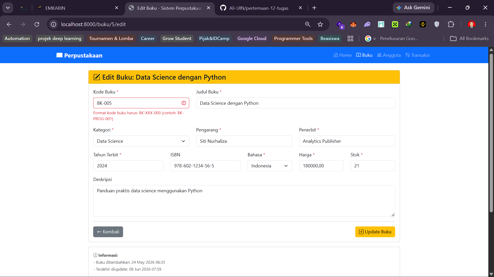
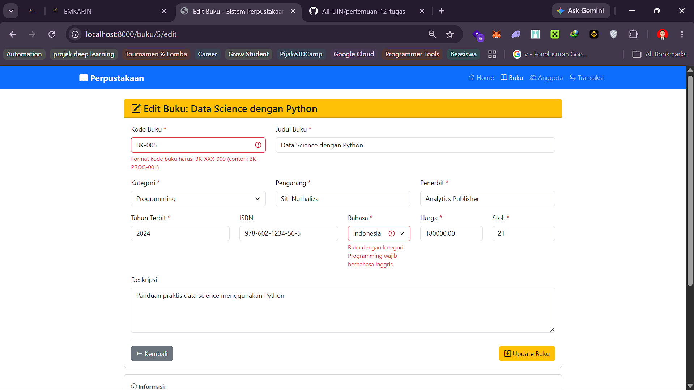
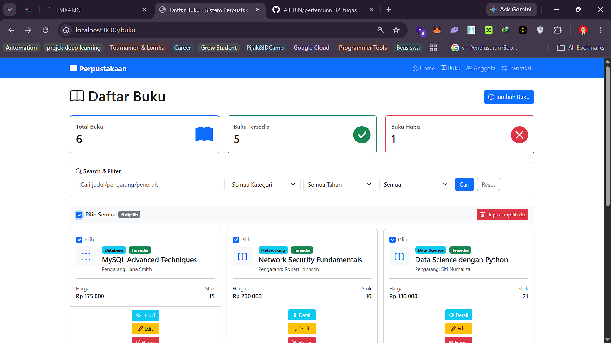
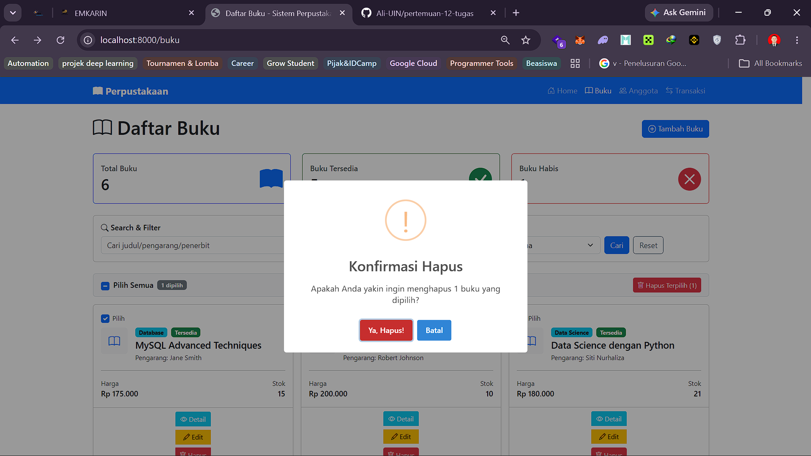
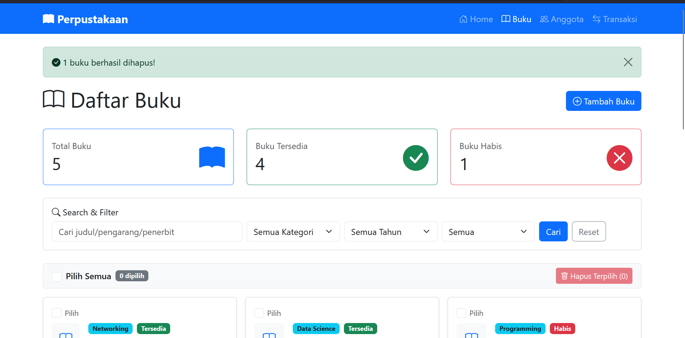
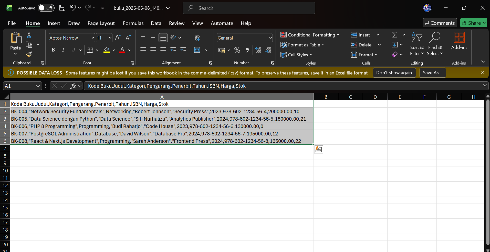
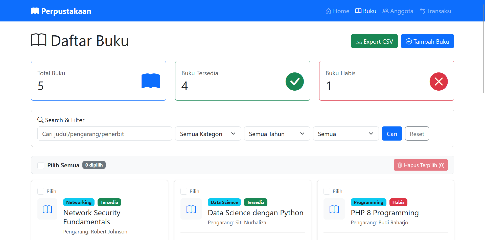
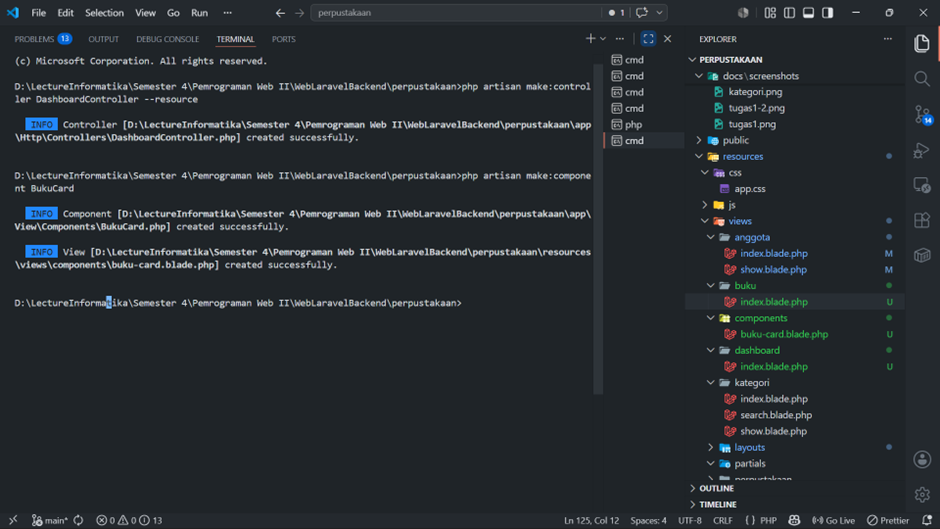

# Sistem Perpustakaan - Pertemuan 12

## Ringkasan

- Tugas 1: Validation Rules Advanced untuk data buku.
- Tugas 2: Bulk delete multiple buku sekaligus.
- Tugas 3: Export data buku ke file CSV.

## Tugas 1 - Validation Rules Advanced

### Ketentuan Validasi

- Kode buku memakai custom rule `KodeBukuFormat`.
- Format kode buku: `BK-[kategori singkat]-[nomor]`.
- Contoh: `BK-PROG-001`, `BK-DB-002`.
- Jika kategori `Programming`, field `bahasa` wajib `Inggris`.
- Semua pesan error menggunakan bahasa Indonesia.

### Lokasi Implementasi

- Rule: [app/Rules/KodeBukuFormat.php](app/Rules/KodeBukuFormat.php)
- Request validation: [app/Http/Requests/StoreBukuRequest.php](app/Http/Requests/StoreBukuRequest.php)
- Request validation: [app/Http/Requests/UpdateBukuRequest.php](app/Http/Requests/UpdateBukuRequest.php)
- Form edit buku: [resources/views/buku/edit.blade.php](resources/views/buku/edit.blade.php)

### Screenshot




## Tugas 2 - Bulk Delete Multiple Buku

### Fitur

- Checkbox pada setiap kartu buku.
- Checkbox `Pilih Semua` untuk memilih seluruh buku.
- Tombol hapus terpilih dengan konfirmasi SweetAlert.
- Delete individual tetap berjalan terpisah dari bulk delete.

### Route

- `/buku/bulk-delete`

### Controller Method

```php
public function bulkDelete(Request $request)
{
	$ids = $request->buku_ids;
	Buku::whereIn('id', $ids)->delete();
	return redirect()->route('buku.index')
				 ->with('success', count($ids) . ' buku berhasil dihapus!');
}
```

### Lokasi Implementasi

- Route: [routes/web.php](routes/web.php)
- Controller: [app/Http/Controllers/BukuController.php](app/Http/Controllers/BukuController.php)
- View index: [resources/views/buku/index.blade.php](resources/views/buku/index.blade.php)
- Card buku: [resources/views/components/buku-card.blade.php](resources/views/components/buku-card.blade.php)

### Screenshot





## Tugas 3 - Export Buku ke CSV

### Fitur

- Button **Export CSV** pada halaman index buku.
- Data buku diunduh sebagai file `.csv`.
- Header CSV berisi kode buku, judul, kategori, pengarang, penerbit, tahun, ISBN, harga, dan stok.

### Route

- `/buku/export`

### Controller Method

```php
public function export()
{
	$bukus = Buku::all();

	$filename = 'buku_' . date('Y-m-d_His') . '.csv';
	$headers = [
		'Content-Type' => 'text/csv',
		'Content-Disposition' => 'attachment; filename="' . $filename . '"',
	];

	$callback = function () use ($bukus) {
		$file = fopen('php://output', 'w');

		fputcsv($file, ['Kode Buku', 'Judul', 'Kategori', 'Pengarang', 'Penerbit', 'Tahun', 'ISBN', 'Harga', 'Stok']);

		foreach ($bukus as $buku) {
			fputcsv($file, [
				$buku->kode_buku,
				$buku->judul,
				$buku->kategori,
				$buku->pengarang,
				$buku->penerbit,
				$buku->tahun_terbit,
				$buku->isbn,
				$buku->harga,
				$buku->stok,
			]);
		}

		fclose($file);
	};

	return response()->stream($callback, 200, $headers);
}
```

### Lokasi Implementasi

- Route: [routes/web.php](routes/web.php)
- Controller: [app/Http/Controllers/BukuController.php](app/Http/Controllers/BukuController.php)
- View index: [resources/views/buku/index.blade.php](resources/views/buku/index.blade.php)

### Screenshot




## Cara Menjalankan

1. Jalankan server:
	```bash
	php artisan serve
	```
2. Buka:
	- `http://localhost:8000/buku`
	- `http://localhost:8000/buku/export`
	- `http://localhost:8000/buku/search?keyword=laravel&kategori=Programming&tahun=2024&ketersediaan=tersedia`

## Dokumentasi Tambahan


