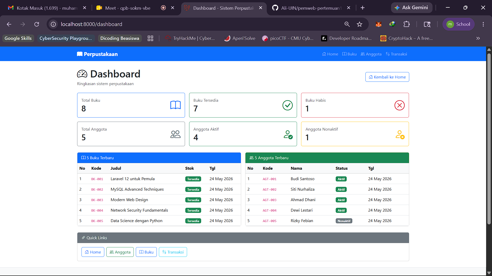
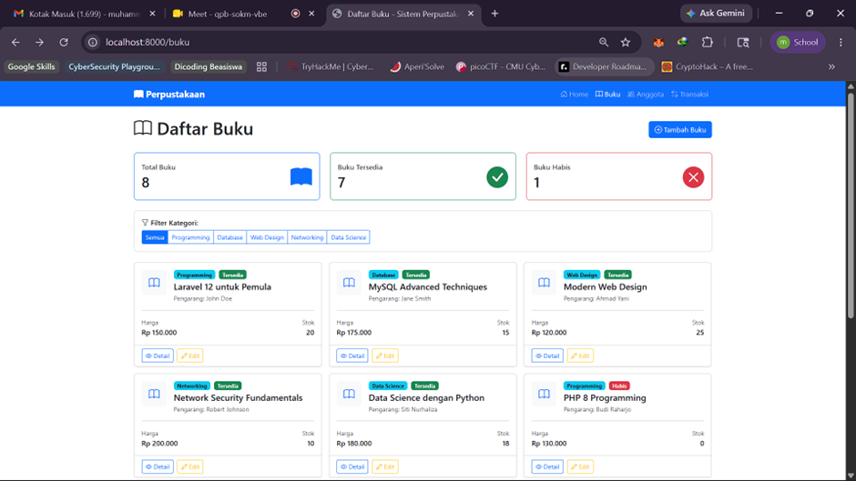
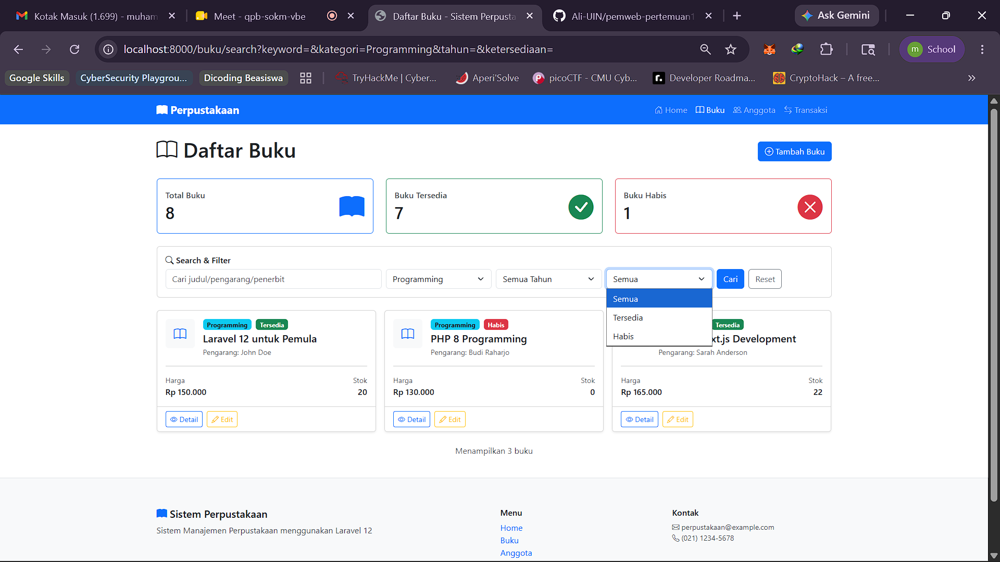

# Sistem Perpustakaan - Tugas 1-3

## Ringkasan

- Tugas 1: Halaman dashboard dengan ringkasan statistik, list terbaru, dan quick links.
- Tugas 2: Blade Component reusable untuk card buku.
- Tugas 3: Search & filter buku advanced (keyword, kategori, tahun, ketersediaan).

## Tugas 1 - Halaman Dashboard

- Controller: `DashboardController@index`
- Route: `/dashboard`
- Data ditampilkan:
	- Total buku, buku tersedia, buku habis
	- Total anggota, anggota aktif, anggota nonaktif
	- List 5 buku terbaru
	- List 5 anggota terbaru
	- Quick links ke menu utama

## Tugas 2 - Blade Component Card Buku

- Generate component: `php artisan make:component BukuCard`
- Props:
	- `$buku` (object Buku)
	- `$showActions` (boolean, default `true`)
- Tampilan:
	- Cover (icon), judul, pengarang, harga, stok
	- Badge kategori
	- Status ketersediaan
	- Button actions (Detail, Edit) jika `$showActions = true`

## Tugas 3 - Search & Filter Buku Advanced

### Form Search

- Input keyword (search judul, pengarang, penerbit)
- Filter kategori (dropdown)
- Filter tahun (dropdown)
- Filter ketersediaan (Semua/Tersedia/Habis)

### Route

- `/buku/search`

### Controller Method

```php
public function search(Request $request)
{
		$query = Buku::query();

		// Filter implementation

		$bukus = $query->latest()->get();
		return view('buku.index', compact('bukus'));
}
```

## Cara Menjalankan

1. Jalankan server:
	 ```bash
	 php artisan serve
	 ```
2. Buka:
	 - `http://localhost:8000/dashboard`
	 - `http://localhost:8000/buku`

## Cara Uji Search & Filter

- Buka `http://localhost:8000/buku`
- Isi form search dan klik **Cari**
- Contoh URL hasil filter:
	- `http://localhost:8000/buku/search?keyword=laravel&kategori=Programming&tahun=2024&ketersediaan=tersedia`

## Dokumentasi





