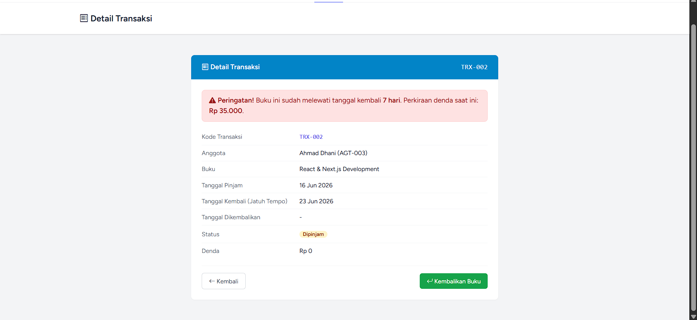
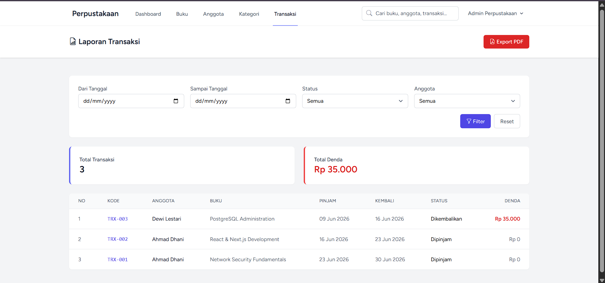
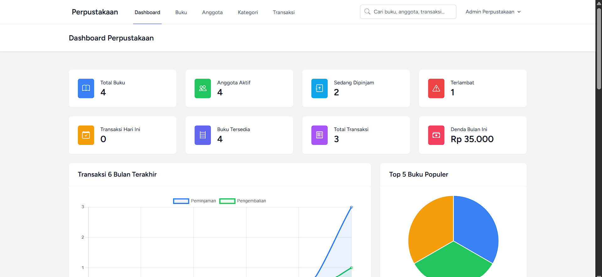
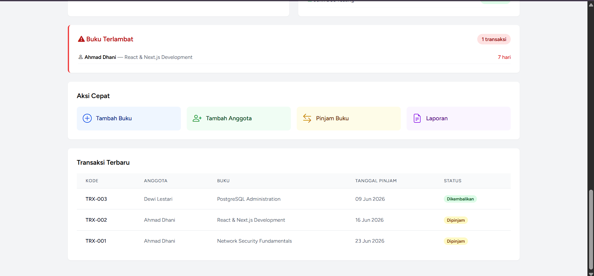

# 📚 Sistem Informasi Perpustakaan — Tugas Pertemuan 14

Implementasi **Tugas Pertemuan 14** mata kuliah Pemrograman Web II berbasis **Laravel**, yang
mencakup tiga fitur lanjutan pada modul transaksi peminjaman:

1. **Pengembalian Buku** + perhitungan denda otomatis
2. **Laporan Transaksi** dengan filter + export PDF
3. **Notifikasi Terlambat** (dashboard widget, badge, & reminder)

> Aplikasi dibangun di atas modul peminjaman/CRUD dari pertemuan sebelumnya
> (Buku, Anggota, Kategori, Dashboard, Global Search).

---

## ✅ Ringkasan Pengerjaan Tugas

| Tugas | Bobot | Status |
|---|---|---|
| **Tugas 1 — Fitur Pengembalian Buku** | 40% | ✅ Selesai |
| **Tugas 2 — Laporan Transaksi** | 30% | ✅ Selesai |
| **Tugas 3 — Notifikasi Terlambat** | 30% | ✅ Selesai |

---

## 📝 Tugas 1: Fitur Pengembalian Buku (40%)

Implementasi lengkap pengembalian buku dengan perhitungan denda keterlambatan.

**Spesifikasi & implementasi:**

- ✅ **View Detail Transaksi** dengan tombol **"Kembalikan Buku"** (dengan konfirmasi SweetAlert2)
  — `resources/views/transaksi/show.blade.php`
- ✅ **Method `kembalikan()`** di controller — `app/Http/Controllers/TransaksiController.php`
- ✅ **Perhitungan Denda:**
  - Denda **Rp 5.000 / hari**
  - **Hanya** dihitung jika terlambat (`$hariTerlambat > 0`) — method `hitungDenda()`
  - Total denda ditampilkan di halaman detail transaksi
- ✅ **Update Stok:** stok buku otomatis **+1** saat dikembalikan (`$transaksi->buku->increment('stok')`)
- ✅ Seluruh proses dibungkus `DB::transaction()` agar konsisten, plus proteksi buku yang
  sudah dikembalikan tidak bisa dikembalikan lagi.

```php
// app/Http/Controllers/TransaksiController.php
private function hitungDenda($transaksi, $tanggalDikembalikan)
{
    $hariTerlambat = (int) floor(
        $transaksi->tanggal_kembali->diffInDays($tanggalDikembalikan, false)
    );
    if ($hariTerlambat > 0) {
        return $hariTerlambat * 5000; // Rp 5.000 / hari
    }
    return 0;
}
```

**📸 Screenshot:** detail transaksi setelah dikembalikan (status *Dikembalikan* + total denda tampil).



---

## 📝 Tugas 2: Laporan Transaksi (30%)

Halaman laporan transaksi dengan filter dan export PDF.

**Spesifikasi & implementasi:**

- ✅ **Route:** `/transaksi/laporan` (`transaksi.laporan`) — `routes/web.php`
- ✅ **Filter:**
  - Range tanggal (`dari` – `sampai`, berdasarkan tanggal pinjam)
  - Status (Semua / Dipinjam / Dikembalikan)
  - Anggota (dropdown dinamis)
- ✅ **Tampilan:**
  - Tabel transaksi hasil filter
  - Total transaksi
  - Total denda
- ✅ **Export PDF:** tombol export laporan ke PDF memakai filter yang sama
  (`barryvdh/laravel-dompdf`) — route `transaksi.laporan.pdf`, view `transaksi/laporan-pdf.blade.php`

```php
// Filter dipakai bersama oleh laporan() & laporanPdf()
private function applyFilter($query, Request $request)
{
    if ($request->filled('dari'))   $query->whereDate('tanggal_pinjam', '>=', $request->dari);
    if ($request->filled('sampai')) $query->whereDate('tanggal_pinjam', '<=', $request->sampai);
    if ($request->filled('status')) $query->where('status', $request->status);
    if ($request->filled('anggota_id')) $query->where('anggota_id', $request->anggota_id);
    return $query;
}
```

**📸 Screenshot:** halaman laporan (`/transaksi/laporan`) dengan filter, tabel, total transaksi & total denda.



---

## 📝 Tugas 3: Notifikasi Terlambat (30%)

Fitur notifikasi untuk buku yang terlambat dikembalikan.

**Spesifikasi & implementasi:**

- ✅ **Dashboard Widget "Buku Terlambat"** — `resources/views/dashboard.blade.php`
  - Card jumlah transaksi yang terlambat
  - List anggota yang terlambat beserta jumlah hari
- ✅ **Badge "Terlambat" (merah)** di index transaksi, menampilkan **berapa hari** terlambat
  — `resources/views/transaksi/index.blade.php`
- ✅ **Reminder** di detail transaksi: warning jika sudah melewati tanggal kembali
  — `resources/views/transaksi/show.blade.php`
- ✅ Didukung **scope** `Transaksi::terlambat()` dan **accessor** `$transaksi->terlambat`
  (jumlah hari terlambat) di `app/Models/Transaksi.php`.

```php
// app/Models/Transaksi.php
public function scopeTerlambat($query)
{
    return $query->where('status', 'Dipinjam')
                 ->whereDate('tanggal_kembali', '<', now());
}
```

**📸 Screenshot:** widget "Buku Terlambat" di dashboard (jumlah + list anggota terlambat), badge "Terlambat X hari" di daftar transaksi, & reminder di detail.





---

## 🛠️ Tech Stack

| Komponen | Teknologi |
|---|---|
| Backend | Laravel (PHP 8.2+) |
| Frontend | Blade, Tailwind CSS, Alpine.js, Vite |
| Database | MySQL |
| UI Helper | Bootstrap Icons, SweetAlert2 |
| Export | barryvdh/laravel-dompdf (PDF) |

---

## 🚀 Instalasi

> Prasyarat: PHP 8.2+, Composer, Node.js & npm, MySQL.

```bash
git clone https://github.com/Ali-UIN/pertemuan-14.git
cd perpustakaan
composer install
npm install
cp .env.example .env
php artisan key:generate
# sesuaikan koneksi database di .env
php artisan migrate --seed
npm run build
php artisan serve
```

Buka <http://localhost:8000>, lalu **Register/Login**, dan akses menu **Transaksi**
serta **Laporan** untuk menguji fitur Pertemuan 14.

---

## 🔗 Route Terkait Pertemuan 14

| Method | URI | Name | Fungsi |
|---|---|---|---|
| `PUT` | `/transaksi/{id}/kembalikan` | `transaksi.kembalikan` | Tugas 1 — pengembalian + denda |
| `GET` | `/transaksi/laporan` | `transaksi.laporan` | Tugas 2 — halaman laporan |
| `GET` | `/transaksi/laporan/pdf` | `transaksi.laporan.pdf` | Tugas 2 — export PDF |
| `GET` | `/dashboard` | `dashboard` | Tugas 3 — widget terlambat |
| `GET` | `/transaksi` | `transaksi.index` | Tugas 3 — badge terlambat |
| `GET` | `/transaksi/{id}` | `transaksi.show` | Tugas 1 & 3 — detail, denda, reminder |

---

## 👤 Author

- **Nama:** Muhammad Irfan Ali
- **Mata Kuliah:** Pemrograman Web II
- **Tugas:** Pertemuan 14 — Pengembalian Buku, Laporan Transaksi, Notifikasi Terlambat
- **Repository:** <https://github.com/Ali-UIN/pertemuan-14>
